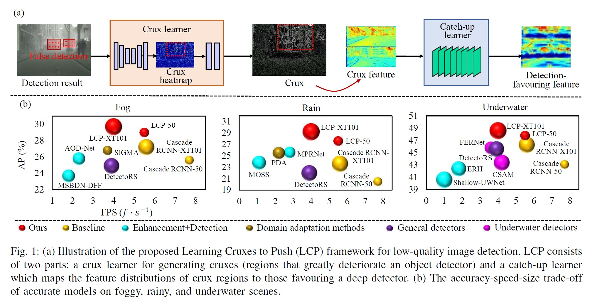
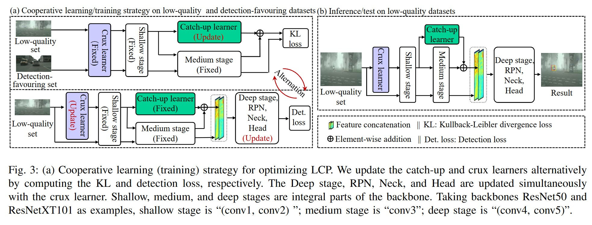

# Learning Cruxes to Push
This repo is the official implementation of [Learning Cruxes to Push for Object Detection in
Low-Quality Images](https://ieeexplore.ieee.org/abstract/document/10606519). It is based on [mmdetection](https://github.com/open-mmlab/mmdetection/tree/2.x) (v2.28.2).
## Introduction
> We also provide an introduction in Chinese [here](https://zhuanlan.zhihu.com/p/710798636).

In a low-quality image, false detection (negatives or positives) is more likely to occur in local regions. In this paper, we propose a simple yet effective strategy with
two learners to solve false detection. We devise the crux
learner to generate cruxes that have great impacts on detection
performance. The catch-up leaner with a simple residual transfer
mechanism maps the feature distributions of crux regions to those
favouring a deep detector. These two learners can be plugged into
any CNN-based feature extraction networks, and yield high detection accuracy on various
degraded scenarios. Extensive experiments on several public
datasets demonstrate that our method achieves more promising
results than state-of-the-art detection approaches.

## Datasets and Learning Strategy
Utilizing a low-quality set and a detection-favored set, we develop a cooperative learning scheme that alternatively
updates the crux and catch-up learner.

As shown in the top part of Fig. 3 (a), we keep the crux
learner fixed and update the catch-up learner using low-quality images and detection-favored images. The
catch-up learner is updated to learn to bridge the gap between the
two feature distributions.

As is shown in the bottom part of Fig.3 (a), we fix the catch-up learner and update the crux-learner, the deep stage, RPN, Neck, and Head. This update step is only updated on low-quality images with semantic labels. After the cooperative learning process, the crux learner can
identify cruxes on a low-quality image according to detection performance. 

We use URPC2020, Foggy-Cityscapes and Rainy-Cityscapes as low-quality sets to evaluate our method on underwater, foggy and rainy scenes separately. 

We use Cityscapes as the detection-favored image set for both rainy and foggy scenes. For the underwater scene, we use DFUI as the detection-favored image set.

- The URPC2020 dataset can be downloaded from [here](https://github.com/xiaoDetection/learning-cruxes-to-push/releases/download/release_datasets/urpc2020.zip).
- The DFUI dataset can be downloaded from [here](https://github.com/xiaoDetection/learning-cruxes-to-push/releases/download/release_datasets/dfui.zip).
- The images and annotations of synthesized Rainy-Cityscapes can be downloaded from [here](https://github.com/xiaoDetection/learning-cruxes-to-push/releases/download/release_datasets/rainy_cityscapes.zip).
- The Foggy-Cityscapes and Cityscapes images can be downloaded from their [official website](https://www.cityscapes-dataset.com/). (We use the same annotations as Rainy-Cityscapes)



## Models and Results
### Foggy Scene (Foggy-Cityscapes)
|Method|Backbone|Pretrain|$AP$|$AP_{50}$|$AP_{75}$|Model|
|:-|:-|:-|:-|:-|:-|:-|
|LCP-50|ResNet50|[cascade_rcnn_r50_city](https://github.com/xiaoDetection/learning-cruxes-to-push/releases/download/release_models/cascade_rcnn_r50_city.pth)|29.0|46.6|30.2|[lcp_r50_foggy_city](https://github.com/xiaoDetection/learning-cruxes-to-push/releases/download/release_models/lcp_r50_foggy_city.pth)|

### Rainy Scene (Rainy-Cityscapes)
|Method|Backbone|Pretrain|$AP$|$AP_{50}$|$AP_{75}$|Model|
|:-|:-|:-|:-|:-|:-|:-|
|LCP-50|ResNet50|[cascade_rcnn_r50_city](https://github.com/xiaoDetection/learning-cruxes-to-push/releases/download/release_models/cascade_rcnn_r50_city.pth)|27.6|45.9|27.9|[lcp_r50_rainy_city](https://github.com/xiaoDetection/learning-cruxes-to-push/releases/download/release_models/lcp_r50_rainy_city.pth)|

### Underwater Scene (URP2020)
|Method|Backbone|Pretrain|$AP$|$AP_{50}$|$AP_{75}$|Model|
|:-|:-|:-|:-|:-|:-|:-|
|LCP-50|ResNet50|[cascade_rcnn_r50_dfui](https://github.com/xiaoDetection/learning-cruxes-to-push/releases/download/release_models/cascade_rcnn_r50_dfui.pth)|47.8|81.8|50.3|[lcp_r50_urpc](https://github.com/xiaoDetection/learning-cruxes-to-push/releases/download/release_models/lcp_r50_urpc.pth)|

## Usage
### Installing
To create a new environment, run:
```shell
conda create -n lcp python=3.10 -y
conda activate lcp
```
To install pytorch run:
```shell
conda install pytorch==1.13.1 torchvision==0.14.1 torchaudio==0.13.1 pytorch-cuda=11.6 -c pytorch -c nvidia -y
```
To install mmdetection, run:
```shell
pip install mmcv-full==1.7.1 -f https://download.openmmlab.com/mmcv/dist/cu116/torch1.13/index.html 

pip install yapf==0.40.1 mmdet==2.28.2 future tensorboard
```
To clone LCP, run:
```shell
git clone https://github.com/xiaoDetection/learning-cruxes-to-push.git
cd learning-cruxes-to-push
```
### Data Preperation
The data should be orginized as follow:
```
learning-cruxes-to-push/
    data/
        city/
            annotations/
            city_images/
            foggy_city_images/
            rainy_city_images/
        urpc2020/
            annotations/
            images/
        dfui/
            images/
```
All images are converted into `jpg` format and stored in folders with the suffix 'images', with no subfolders included.


### Testing
Here we take `LCP-50` on URPC2020 as an example.

First download our checkpoint file to `checkpoints/lcp_r50_urpc.pth`:
```shell
mkdir checkpoints
wget -P ./checkpoints/ https://github.com/xiaoDetection/learning-cruxes-to-push/releases/download/release_models/lcp_r50_urpc.pth
```
Then test our model (set '--cfg-options' to avoid loading pre-trained weights):
```shell
python tools/test.py \
    configs/lcp_r50_urpc.py \
    ./checkpoints/lcp_r50_urpc.pth \
    --eval bbox \
    --cfg-options model.init_cfg=None
```
### Training
Here we take a training on the  underwater scene as an example.

Fist download our pre-trained model:
```shell
wget -P ./checkpoints/ http://
```
Then train a model:
```shell
python tools/train.py \
    configs/lcp_r50_urpc.py
```

The results will be saved in `work_dirs/lcp_r50_urpc/`. 

### Training on a custom dataset
Please convert your labels into COCO format and place your annotations and images into `data/` folder accoriding to the structure described [above](#data-preperation).

Then, in the config file, modify `num_classes`, `img_prefix`, `img_df_prefix`, `train_ann`, `test_ann` and `classes` according to your dataset.
- `num_classes` is the number of classes in your dataset.
- `img_prefix` is the prefix of your  low-quality images.
- `img_df_prefix` is the prefix of your detection-favored images.
- `train_ann` is the path of your training annotations.
- `classes` is the tuple of class names in your dataset.

Then train a model:
```shell
python tools/train.py \
    YOUR_CONFIG_FILE.py
```

The results will be saved in `work_dirs/YOUR_CONFIG_FILE/`.

**Notes:**
- Config files of other scenes can be found in [configs/](configs/).
- Other models can be found in section [Models and Results](#models-and-results).
- For more information (e.g., about modifying runtime settings or modifying models), please refer to [MMDetection's documentation](https://mmdetection.readthedocs.io/en/v2.28.2/).

## Citation
```
@ARTICLE{10606519,
    author={Fu, Chenping and Xiao, Jiewen and Yuan, Wanqi and Liu, Risheng and Fan, Xin},
    journal={IEEE Transactions on Circuits and Systems for Video Technology}, 
    title={Learning Cruxes to Push for Object Detection in Low-Quality Images}, 
    year={2024},
    volume={},
    number={},
    pages={1-1},
    keywords={Detectors;Feature extraction;Convolution;Accuracy;Training;Rain;Degradation;Object detection;low-quality scenes;image enhancement},
    doi={10.1109/TCSVT.2024.3432580}
}
```